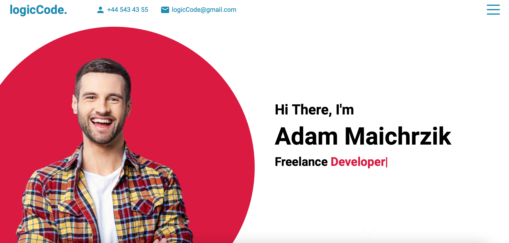
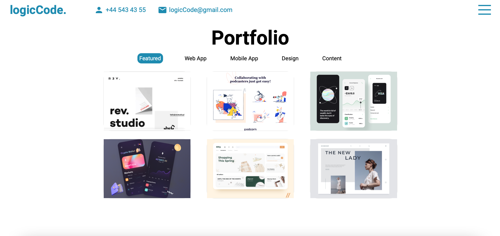
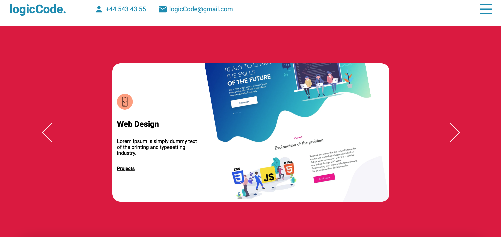
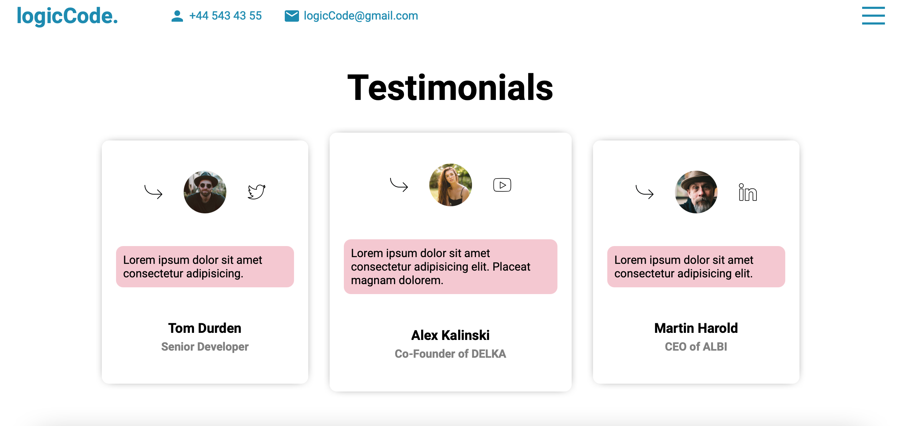
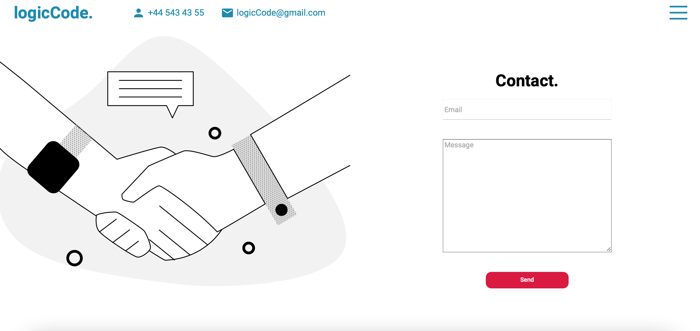

# Getting Started with creating React apps

First react app from awesome youtube tutorial. I learned a lot! Also in this tutorial I learned how to use the SASS CSS :) Everything explained correctly and slowly so you can learn a lot. 

This project is from [youtube tutorial](https://www.youtube.com/watch?v=7WwtzsSHdpI&t=4s).

## Check out the Lama Dev youtube channel

You can learn more from him [here](https://www.youtube.com/channel/UCOxWrX5MIdXIeRNaXC3sqIg).

# Website screenshots

## Intro page

## Intro page with rightbar menu

## Portfolio page

## Works page

## Testimonials page

## Contact page

